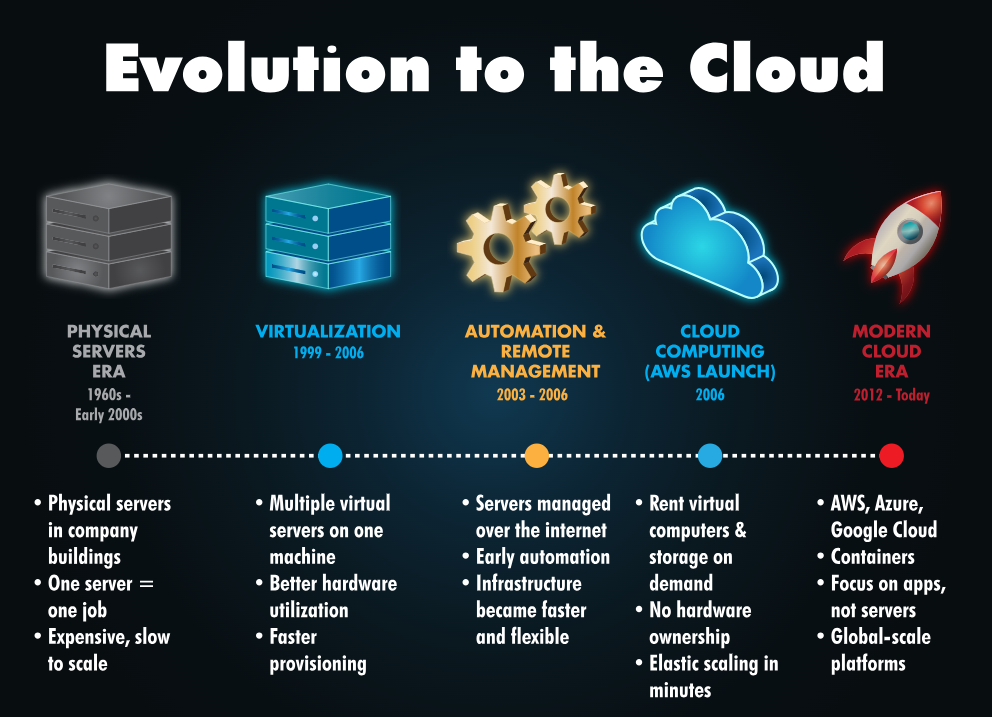

[<-- Back to Computer Menu](../computer/00-MENU.md)

# 📌 Cloud Computing

> Cloud Computing là mô hình cung cấp tài nguyên CNTT qua Internet, giúp ứng dụng có thể mở rộng linh hoạt, truy cập từ mọi nơi và giảm nhu cầu tự quản lý hạ tầng phần cứng.

---

## 📖 Khái niệm

**Cloud Computing** là mô hình sử dụng tài nguyên máy tính thông qua Internet thay vì phải tự sở hữu và vận hành toàn bộ phần cứng.

Các tài nguyên có thể được cung cấp qua cloud bao gồm:

- Computing
- Storage
- Database
- Networking
- Security
- Application Platform

*Thay vì lưu file chỉ trên một laptop, người dùng có thể lưu file trên cloud và truy cập chúng từ nhiều thiết bị, ở nhiều nơi khác nhau*

Cloud Computing giúp ứng dụng:

- Dễ dàng truy cập.
- Mở rộng khi số lượng người dùng tăng.
- Tăng khả năng sẵn sàng.
- Giảm chi phí đầu tư phần cứng ban đầu.
- Giảm công việc quản lý hạ tầng.

---

## ⚙️ Cách hoạt động

### 1. Quá trình phát triển từ Server đến Cloud

Cloud Computing không xuất hiện đột ngột mà là kết quả của quá trình phát triển hạ tầng CNTT.

  

### Physical Server

Ban đầu, một ứng dụng thường chạy trực tiếp trên một server vật lý.

Nhược điểm:

- Chi phí phần cứng cao.
- Tài nguyên dễ bị lãng phí.
- Khó mở rộng nhanh.
- Nếu server gặp sự cố, ứng dụng có thể bị ảnh hưởng.

---

### Virtualization

Virtualization cho phép một server vật lý chạy nhiều **Virtual Machine** thông qua Hypervisor.

Điều này giúp sử dụng tài nguyên hiệu quả hơn và dễ dàng triển khai nhiều hệ thống trên cùng một máy chủ.

---

### Cloud Computing

Cloud mở rộng ý tưởng này thành một hệ thống hạ tầng lớn, nơi tài nguyên có thể được cung cấp theo nhu cầu thông qua Internet.

Thay vì mua một server mới mỗi khi cần thêm tài nguyên, doanh nghiệp có thể yêu cầu cloud provider cung cấp thêm tài nguyên.

---

### 2. Đặc điểm và lợi ích của Cloud
<table align="center">
  <tr>
    <th align="center">Đặc điểm</th>
    <th align="center">Lợi ích</th>
  </tr>
  <tr>
    <td align="center">Scalability</td>
    <td align="center">Có thể tăng hoặc giảm tài nguyên tùy theo nhu cầu</td>
  </tr>
  <tr>
    <td align="center">On-demand Self-service</td>
    <td align="center">Người dùng có thể tự tạo hoặc xóa server, storage và các tài nguyên khác mà không cần chờ mua và lắp đặt phần cứng</td>
  </tr>
  <tr>
    <td align="center">Pay Only for What You Use</td>
    <td align="center">Thay vì đầu tư một khoản lớn để mua phần cứng trước, người dùng trả tiền dựa trên lượng tài nguyên đã sử dụng</td>
  </tr>
  <tr>
    <td align="center">Security</td>
    <td align="center">Cloud provider cung cấp nhiều cơ chế bảo vệ hạ tầng và dịch vụ (bảo mật trên cloud vẫn là **shared responsibility** giữa cloud provider và khách hàng)</td>
  </tr>
  <tr>
    <td align="center">High Availability</td>
    <td align="center">Cloud có thể triển khai hệ thống trên nhiều server hoặc nhiều khu vực để giảm ảnh hưởng khi một thành phần gặp sự cố</td>
  </tr>
  <tr>
    <td align="center">Global Access</td>
    <td align="center">Ứng dụng được triển khai trên Internet và có thể phục vụ người dùng ở nhiều khu vực trên thế giới</td>
  </tr>
</table>

---

## ☁️ Các loại Cloud
<table align="center">
  <tr>
    <th align="center">Loại</th>
    <th align="center">Định nghĩa</th>
    <th align="center">Đặc điểm</th>
    <th align="center">Ví dụ</th>
  </tr>
  <tr>
    <td align="center">Public</td>
    <td align="center">Cloud infrastructure được cung cấp bởi một cloud provider và phục vụ nhiều khách hàng</td>
    <td align="center">
          Dễ triển khai 
          Có khả năng mở rộng cao 
          Không cần tự quản lý toàn bộ phần cứng 
          Phù hợp với startup, website và nhiều loại ứng dụng
    </td>
    <td align="center">
          AWS 
          Microsoft Azure 
          Google Cloud
    </td>
  </tr>
  <tr>
    <td align="center">Private</td>
    <td align="center">Môi trường cloud được dành riêng cho một tổ chức</td>
    <td align="center">
          Kiểm soát cao hơn 
          Có khả năng tùy chỉnh sâu 
          Phù hợp với các hệ thống yêu cầu kiểm soát và compliance cao
    </td>
    <td align="center">
          Ngân hàng 
          Chính phủ 
          Doanh nghiệp có dữ liệu nhạy cảm
    </td>
  </tr>
  <tr>
    <td align="center">Hybrid</td>
    <td align="center">Kết hợp giữa Public Cloud và Private Cloud</td>
    <td align="center"></td>
    <td align="center">Một doanh nghiệp có thể giữ dữ liệu nhạy cảm trên Private Cloud nhưng sử dụng Public Cloud để mở rộng hệ thống khi lượng truy cập tăng cao</td>
  </tr>
</table>

---

## 🧩 Cloud Service Models

Cloud không chỉ có nhiều cách triển khai mà còn có nhiều mức độ quản lý dịch vụ.

### 1. IaaS – Infrastructure as a Service

Người dùng thuê các tài nguyên cơ bản như:

- Virtual Server
- Storage
- Network

> Cloud provider quản lý phần cứng vật lý, trong khi người dùng chịu trách nhiệm nhiều hơn đối với hệ điều hành và ứng dụng.

---

### 2. PaaS – Platform as a Service

Cloud provider quản lý infrastructure và operating system.

Người dùng tập trung vào:

- Viết code.
- Deploy application.
- Quản lý application và data.

> PaaS phù hợp khi developer muốn tập trung vào việc xây dựng ứng dụng thay vì quản lý server.

---

### 3. SaaS – Software as a Service

**SaaS** cung cấp một ứng dụng hoàn chỉnh thông qua Internet.

Người dùng chủ yếu chỉ cần sử dụng ứng dụng.

---

### 🏠 So sánh IaaS, PaaS và SaaS
<table align="center">
  <tr>
    <th align="center">Mô hình</th>
    <th align="center">Bạn quản lý</th>
    <th align="center">Cloud Provider quản lý</th>
  </tr>
  <tr>
    <td align="center">IaaS</td>
    <td align="center">OS, Application, Data</td>
    <td align="center">Hardware, Virtualization</td>
  </tr>
  <tr>
    <td align="center">PaaS</td>
    <td align="center">Application, Data</td>
    <td align="center">Chủ yếu sử dụng phần mềm</td>
  </tr>
  <tr>
    <td align="center">SaaS</td>
    <td align="center">Infrastructure, OS, Runtime</td>
    <td align="center">Gần như toàn bộ hệ thống</td>
  </tr>
</table>

---

## 🌐 Major Cloud Vendors

Một số cloud provider lớn gồm:
<table align="center">
  <tr>
    <th align="center">Provider</th>
    <th align="center">Điểm nổi bật</th>
  </tr>
  <tr>
    <td align="center">Amazon Web Services (AWS)</td>
    <td align="center">Hệ sinh thái dịch vụ cloud rất rộng</td>
  </tr>
  <tr>
    <td align="center">Microsoft Azure</td>
    <td align="center">Enterprise và Hybrid Cloud</td>
  </tr>
  <tr>
    <td align="center">Google Cloud Platform (GCP)</td>
    <td align="center">Data Analytics, AI và Machine Learning</td>
  </tr>
  <tr>
    <td align="center">Alibaba Cloud</td>
    <td align="center">Thế mạnh tại thị trường châu Á</td>
  </tr>
  <tr>
    <td align="center">IBM Cloud</td>
    <td align="center">Hybrid Cloud và AI</td>
  </tr>
  <tr>
    <td align="center">Oracle Cloud</td>
    <td align="center">Enterprise Applications và Database</td>
  </tr>
</table>

---

## 📝 Ghi nhớ

- **Cloud Computing** = sử dụng tài nguyên CNTT thông qua Internet.
- Cloud giúp hệ thống **Scalable, Available, Flexible và Globally Accessible**.
- Cloud phát triển từ quá trình tiến hóa của **Physical Server → Virtualization → Cloud**.
- **Public Cloud**: hạ tầng cloud cung cấp cho nhiều khách hàng.
- **Private Cloud**: môi trường cloud dành riêng cho một tổ chức.
- **Hybrid Cloud**: kết hợp Public Cloud và Private Cloud.
- **IaaS**: thuê Infrastructure.
- **PaaS**: thuê Platform để phát triển và chạy ứng dụng.
- **SaaS**: sử dụng phần mềm hoàn chỉnh qua Internet.

---

## 🔗 Liên quan

* **Virtualization**
* **Hypervisor**
* **Virtual Machine (VM)**
* **Container**
* **Docker**
* **Networking**
* **Load Balancer**
* **High Availability**
* **Scalability**
* **Infrastructure as Code (IaC)**
* **DevOps**
* **Cloud Security**
* **Shared Responsibility Model**
* **AWS**
* **Microsoft Azure**
* **Google Cloud**

---

## 📚 Nguồn tham khảo

- [TryHackMe](https://tryhackme.com/room/cloudcomputingfundamentals)

[<-- Back to Computer Menu](../computer/00-MENU.md)