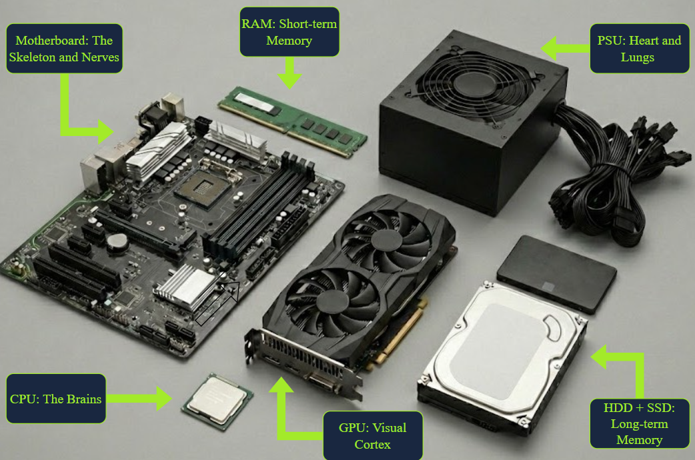
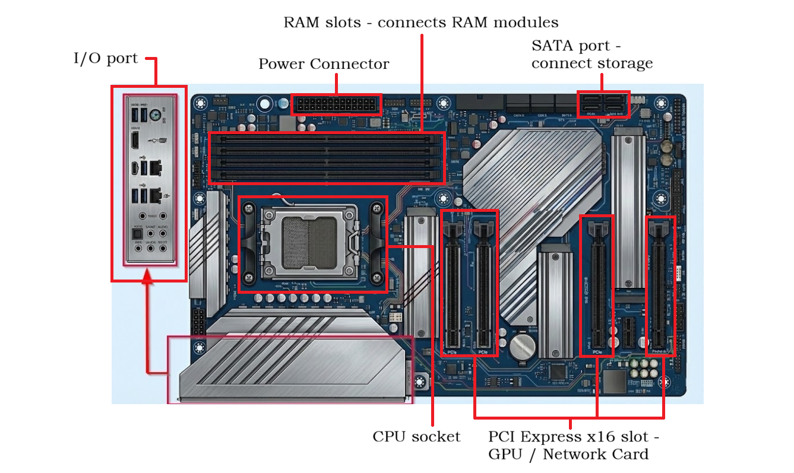
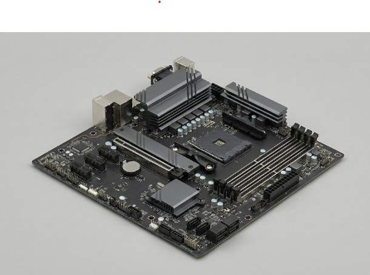
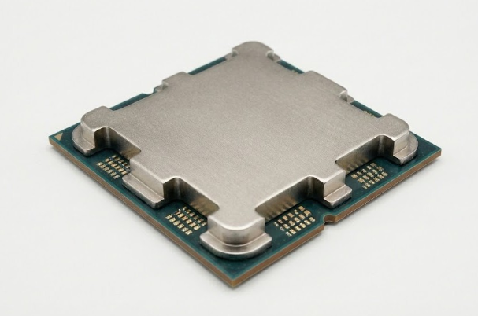
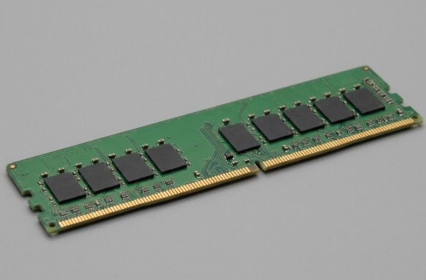
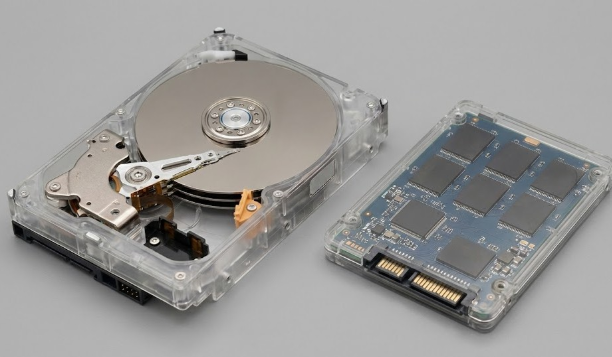
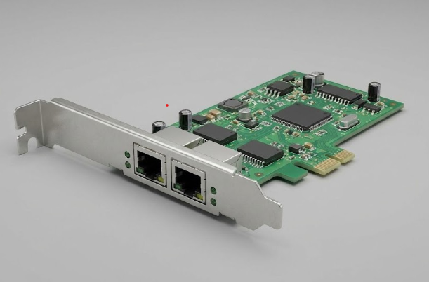
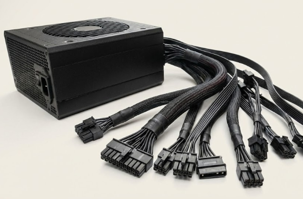
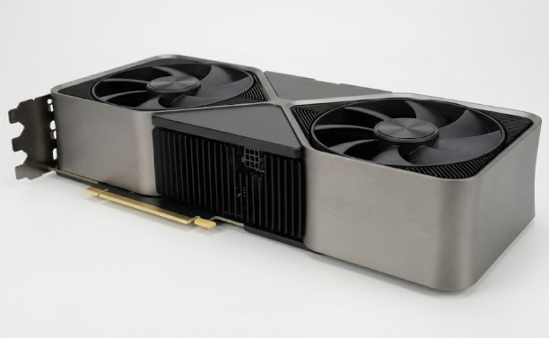
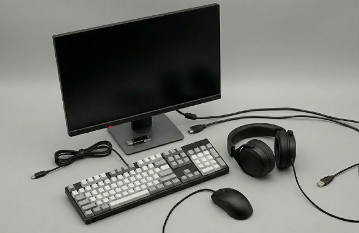

[<-- Back to Computer Menu](../computer/00-MENU.md)

# 📌 Inside a Computer System

> Trước khi học cách bảo vệ máy tính, chúng ta cần hiểu về nó trước.

    

        
         
        <i>Building blocks</i>
    

    

        
         
        <i>Locations of the blocks</i>
    

---

## 🎯 Bo mạch chủ - Motherboard

- Bo mạch chủ giống như bộ xương và hệ thần kinh của cơ thể chúng ta. 
- Nó giữ tất cả các thành phần khác nhau tại chỗ và kết nối chúng. 
- Trên bo mạch chủ máy tính để bàn thông thường, bạn sẽ thấy các đầu nối khác nhau chứa tất cả các thành phần của bạn - ổ cắm CPU, khe cắm RAM, khe cắm mở rộng và các cổng khác nhau. 
- Mọi thành phần khác cắm vào hoặc kết nối thông qua bo mạch chủ.   

  
   
  <i>Motherboard</i>

---

## 🎯 CPU - Central Processing Unit (Bộ xử lý trung tâm)

- Giống như bộ não của chúng ta liên tục thực hiện các hướng dẫn (cộng số, đổ sữa vào bát, v.v.), CPU cũng làm điều tương tự đối với máy tính.
- CPU hiện đại có nhiều lõi xử lý các lệnh song song.
- CPU kết nối với bo mạch chủ thông qua ổ cắm CPU.

  
   
  <i>CPU</i>

---

## 🎯 RAM - Random Access Memory (Bộ nhớ truy cập ngẫu nhiên)

- Có thể so sánh với bộ nhớ ngắn hạn hoặc bộ nhớ làm việc của não chúng ta. 
- Khi thực hiện một nhiệm vụ, chúng ta tạm thời ghi nhớ những thông tin liên quan. RAM cũng làm như vậy - nó chứa dữ liệu mà CPU cần truy cập nhanh. 
- RAM không ổn định: khi mất điện, tất cả nội dung sẽ biến mất. 
- Các mô-đun RAM hiện đại sử dụng các công nghệ như DDR5 hoặc DDR6 để tăng tốc độ và hiệu suất.

  
   
  <i>RAM</i>

---

## 🎯 Thiết bị lưu trữ (SSD/HDD)

- SSD và HDD là những thiết bị lưu trữ có thể so sánh với bộ nhớ dài hạn của chúng ta. 
- Cũng giống như những kỷ niệm đẹp được ghi nhớ vĩnh viễn, dữ liệu được lưu lâu dài trên các thiết bị lưu trữ. 
- HDD sử dụng công nghệ cũ với các bộ phận chuyển động nên hạn chế hiệu suất. 
- SSD không có bộ phận chuyển động và sử dụng chip nhớ, cho phép tốc độ nhanh hơn nhiều. 
- Ổ cứng HDD vẫn được ưa chuộng vì dung lượng lớn với chi phí thấp. 
- Bộ lưu trữ kết nối qua cáp SATA hoặc khe cắm PCI Express.

  
   
  <i>Storage</i>

---

## 🎯 Card mạng - Network Adapter

- Giống như chúng ta sử dụng dây thanh âm để giao tiếp với môi trường, bộ điều hợp mạng cho phép máy tính giao tiếp với các hệ thống khác. 
- Bộ điều hợp mạng có các biến thể không dây và có dây. 
- Thông thường chúng được nhúng vào bo mạch chủ nhưng chúng cũng có thể được thêm vào dưới dạng thẻ mở rộng. 
- Card mạng thường kết nối qua cổng PCI Express.

  
   
  <i>Network Adapter</i>

---

## 🎯 Nguồn điện - Power Supply (PSU)

- Giống như trái tim của chúng ta bơm máu đến các cơ quan, PSU cung cấp năng lượng cho tất cả các thành phần của hệ thống. 
- PSU rất cần thiết và cần được xem xét cẩn thận - nếu các bộ phận cần nhiều năng lượng hơn mức PSU có thể cung cấp thì hệ thống sẽ bị lỗi. 
- PSU lấy nguồn từ ổ cắm và phân phối điện qua nhiều đầu nối khác nhau như đầu nối bo mạch chủ chính và đầu nối Molex.

  
   
  <i>Power Supply</i>

---

## 🎯 Card đồ họa - Graphics Card

- Card đồ họa có thể so sánh với vỏ não thị giác của não chúng ta. Mắt chúng ta tiếp nhận thông tin và vỏ não thị giác xử lý nó thành hình ảnh. 
- Tương tự, card đồ họa nhận thông tin từ hệ điều hành và các chương trình, sau đó xuất dữ liệu hình ảnh đã được xử lý ra màn hình. 
- Card đồ họa kết nối với khe cắm PCI Express trên bo mạch chủ.

  
   
  <i>Graphics Card</i>

---

## 🎯 Thiết bị đầu vào / đầu ra - I/O

- Giống như chúng ta có các giác quan để thu thập thông tin cho bộ não xử lý và sau đó hành động, máy tính cũng có các thiết bị đầu vào và đầu ra. 
- Các thiết bị đầu vào bao gồm bàn phím, micro, chuột và máy quét. 
- Thiết bị đầu ra bao gồm màn hình, máy in và loa. Các đầu nối phổ biến cho các thiết bị ngoại vi này bao gồm USB, HDMI và DisplayPort.

  
   
  <i>I/O</i>

---

## 📚 Nguồn tham khảo

- [TryHackMe](https://tryhackme.com/room/insideacomputer)

[<-- Back to Computer Menu](../computer/00-MENU.md)