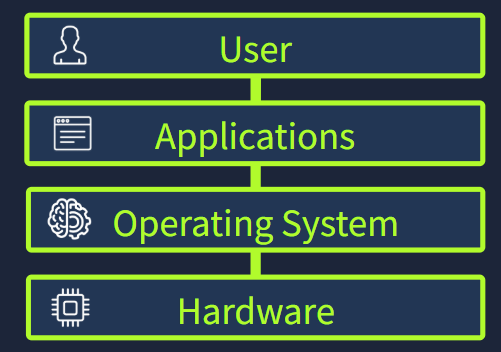

[<-- Back to Operating System Menu](../operating-system/00-MENU.md)

# 📌 Operating System (OS) – Hệ điều hành

> Operating System (OS) là phần mềm lõi quản lý phần cứng, tài nguyên hệ thống và cung cấp môi trường để người dùng và ứng dụng tương tác với máy tính.

---

## 📖 Khái niệm

**Operating System (OS)** là phần mềm cốt lõi chịu trách nhiệm quản lý và điều phối toàn bộ hoạt động của máy tính.

OS nằm giữa **người dùng, ứng dụng và phần cứng**, đóng vai trò như một lớp trung gian giúp các thành phần trong hệ thống hoạt động thống nhất.

<p align="center">
  
</p>

Nếu không có OS, mỗi ứng dụng sẽ phải tự quản lý trực tiếp CPU, RAM, Storage, thiết bị ngoại vi và các tài nguyên khác.

Điều này dễ dẫn đến:

* Xung đột tài nguyên.
* Ứng dụng ảnh hưởng lẫn nhau.
* Khó quản lý phần cứng.
* Khó kiểm soát quyền truy cập.
* Khó đảm bảo an toàn cho hệ thống.

Vì vậy, OS đóng vai trò là **bộ điều phối trung tâm** của máy tính.

---

## ⚙️ Cách hoạt động

### 1. System Privilege Layers

Một hệ điều hành hiện đại chia môi trường hoạt động thành các mức quyền khác nhau.

Hai khu vực quan trọng:

---

### Kernel Space

**Kernel Space** là vùng có đặc quyền cao nhất của hệ điều hành.

**Kernel** là thành phần cốt lõi của OS, chịu trách nhiệm trực tiếp quản lý:

* CPU
* RAM
* Storage
* Network
* Hardware devices
* System resources

Kernel có quyền truy cập rất cao đối với hệ thống.

---

### User Space

**User Space** là môi trường mà các ứng dụng thông thường hoạt động.

Các ứng dụng trong User Space không được phép truy cập trực tiếp vào phần cứng.

Khi ứng dụng cần thực hiện một thao tác đặc quyền, nó phải yêu cầu Kernel thông qua **System Call**.

---

### 2. Các nhiệm vụ chính của Operating System

| Trách nhiệm                | OS thực hiện                               | Ví dụ                                       |
| -------------------------- | ------------------------------------------ | ------------------------------------------- |
| **Process Management**     | Tạo, lập lịch, ưu tiên và kết thúc process | Chạy đồng thời trình duyệt, trình phát nhạc |
| **Memory Management**      | Phân bổ và bảo vệ RAM giữa các process     | Mỗi ứng dụng có vùng nhớ riêng              |
| **File System Management** | Quản lý file, thư mục, đường dẫn và quyền  | Tạo folder, lưu file, đặt file Read-only    |
| **User Management**        | Quản lý tài khoản, xác thực và quyền       | Đăng nhập bằng mật khẩu                     |
| **Device Management**      | Quản lý thiết bị và driver                 | Kết nối chuột, máy in, USB                  |
| **Security**               | Kiểm soát quyền và bảo vệ tài nguyên       | Ngăn ứng dụng truy cập trái phép            |

---

### 3. Operating System và Security

OS là một trong những nền tảng bảo mật quan trọng nhất của hệ thống.

Các cơ chế như:

* User Account.
* Authentication.
* Authorization.
* File Permission.
* Process Isolation.
* User Space / Kernel Space.
* System Call.

giúp hạn chế việc ứng dụng hoặc người dùng truy cập trái phép vào tài nguyên hệ thống.

Vì vậy, trước khi sử dụng các công cụ như Antivirus, Firewall hoặc EDR, cần hiểu rằng **Operating System chính là một trong những lớp bảo vệ nền tảng của máy tính**.

---

## 🖥️ Cách tương tác với Operating System

Có hai cách tương tác phổ biến với OS:

---

### 1. GUI – Graphical User Interface

GUI cung cấp giao diện đồ họa để người dùng tương tác với hệ điều hành.

Các thành phần quen thuộc:

* Windows.
* Icons.
* Folders.
* Menus.
* Buttons.
* Settings.

GUI giống như việc sử dụng ứng dụng bản đồ: người dùng chỉ cần chọn địa điểm trên giao diện thay vì phải nhập chính xác tọa độ.

---

### 2. CLI – Command-Line Interface

CLI cho phép người dùng tương tác với OS bằng các câu lệnh dạng text.

CLI thường có ưu điểm:

* Chính xác.
* Nhanh.
* Có khả năng tự động hóa.
* Phù hợp với System Administration.
* Phù hợp với Cyber Security.
* Có thể quản lý hệ thống từ xa.

CLI yêu cầu người dùng phải biết chính xác cú pháp và câu lệnh cần sử dụng.

---

## 🧩 Các loại Operating System

Operating System có thể được phân loại dựa trên mục đích sử dụng.

| Loại OS           | Mục đích                          | Đặc điểm                              |
| ----------------- | --------------------------------- | ------------------------------------- |
| **Desktop**       | Máy tính cá nhân                  | GUI, chạy nhiều ứng dụng              |
| **Server**        | Web, Database, Backend            | Uptime cao, multi-user, remote access |
| **Mobile**        | Smartphone, Tablet                | Touch UI, tiết kiệm năng lượng        |
| **Embedded**      | IoT, Router, thiết bị chuyên dụng | Nhỏ gọn, tài nguyên hạn chế           |
| **Virtual/Cloud** | VM, Cloud Instance, Lab           | Nhẹ, scalable, triển khai nhanh       |

---

## 🌍 Operating System phổ biến trong thực tế

### Desktop

**Windows**

* Hệ điều hành phổ biến trên máy tính cá nhân.
* Windows 11 là phiên bản desktop hiện tại phổ biến.

**macOS**

* Hệ điều hành desktop của Apple.
* Tích hợp chặt chẽ với hệ sinh thái Apple.

**Linux**

Linux không phải chỉ là một hệ điều hành duy nhất mà là một họ các hệ điều hành mã nguồn mở được phân phối dưới dạng **distribution (distro)**.

Ví dụ:

* Ubuntu.
* Debian.
* Fedora.

---

### Server

**Windows Server**

Được sử dụng trong:

* Corporate Network.
* Data Center.
* Enterprise Environment.

Ví dụ:

* Windows Server 2019.
* Windows Server 2022.
* Windows Server 2025.

**Linux**

Linux được sử dụng rộng rãi trong server và cloud.

Ví dụ:

* Ubuntu Server.
* Debian.
* Red Hat Enterprise Linux.
* Rocky Linux.

**Unix**

Thường xuất hiện trong các hệ thống enterprise đặc thù.

Ví dụ:

* IBM AIX.
* Oracle Solaris.

---

### Mobile

**Android**

Hệ điều hành mobile phổ biến trên nhiều loại smartphone, tablet và thiết bị thông minh.

**iOS**

Hệ điều hành mobile của Apple, được sử dụng trên iPhone và các thiết bị Apple hỗ trợ.

---

### Embedded và IoT

**Embedded Linux**

Các hệ điều hành Linux được tùy biến cho thiết bị chuyên dụng.

Ví dụ:

* OpenWrt.
* Ubuntu Core.
* Yocto Project.

**Real-Time Operating System (RTOS)**

Được thiết kế cho các hệ thống yêu cầu thời gian phản hồi có tính xác định.

Ví dụ:

* FreeRTOS.
* VxWorks.
* QNX.

---

### Virtual và Cloud

Các hệ thống cloud và VM thường sử dụng các OS được tối ưu cho server và cloud workload.

Ví dụ:

* Ubuntu LTS.
* Amazon Linux.
* Rocky Linux.

Ngoài ra còn có các OS tối ưu cho container:

* Alpine Linux.
* Bottlerocket.
* Flatcar Linux.

---

## 📝 Ghi nhớ

* **Operating System** là phần mềm lõi quản lý tài nguyên và điều phối hoạt động của máy tính.
* **Kernel Space** có quyền đặc biệt và trực tiếp quản lý tài nguyên hệ thống.
* **User Space** là môi trường chạy các ứng dụng thông thường.
* Ứng dụng sử dụng **System Call** để yêu cầu Kernel thực hiện các thao tác đặc quyền.
* Các nhiệm vụ quan trọng của OS gồm:

```text
Process Management
Memory Management
File System Management
User Management
Device Management
Security
```

* **GUI** phù hợp với thao tác trực quan.
* **CLI** mạnh về tốc độ, độ chính xác và tự động hóa.
* Các nhóm OS chính:

```text
Desktop
Server
Mobile
Embedded
Virtual / Cloud
```

---

## 🔗 Liên quan

* **Computer Hardware**
* **Kernel**
* **System Call**
* **Process**
* **Memory Management**
* **File System**
* **User & Permission**
* **Device Driver**
* **GUI**
* **CLI**
* **Linux**
* **Windows**
* **macOS**
* **Android**
* **iOS**
* **Virtualization**
* **Cloud Computing**
* **System Administration**
* **Cyber Security**
* **Incident Response**

---

## 📚 Nguồn tham khảo

* [TryHackMe – Operating Systems](https://tryhackme.com/room/operatingsystemsintroduction)
* Microsoft Learn – Windows
* Microsoft Learn – PowerShell
* Linux Documentation
* Ubuntu Documentation
* Apple – macOS Documentation
* Android Developers
* IBM Documentation – Operating Systems

[<-- Back to Operating System Menu](../operating-system/00-MENU.md)