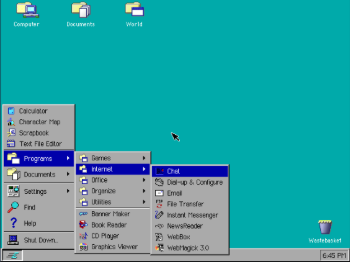
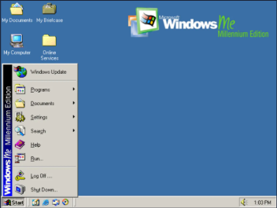
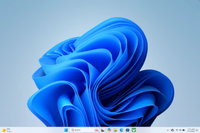
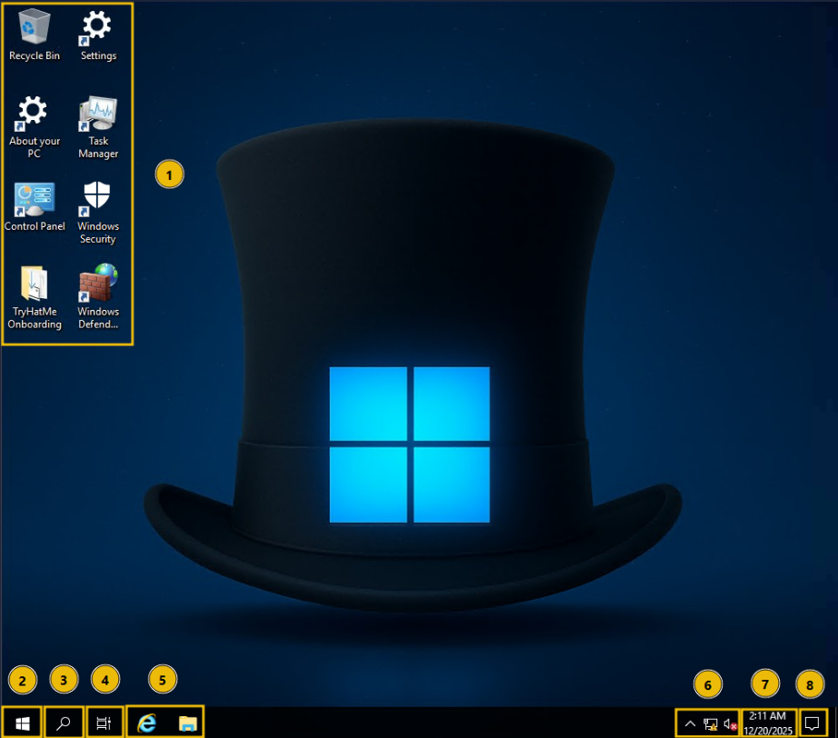
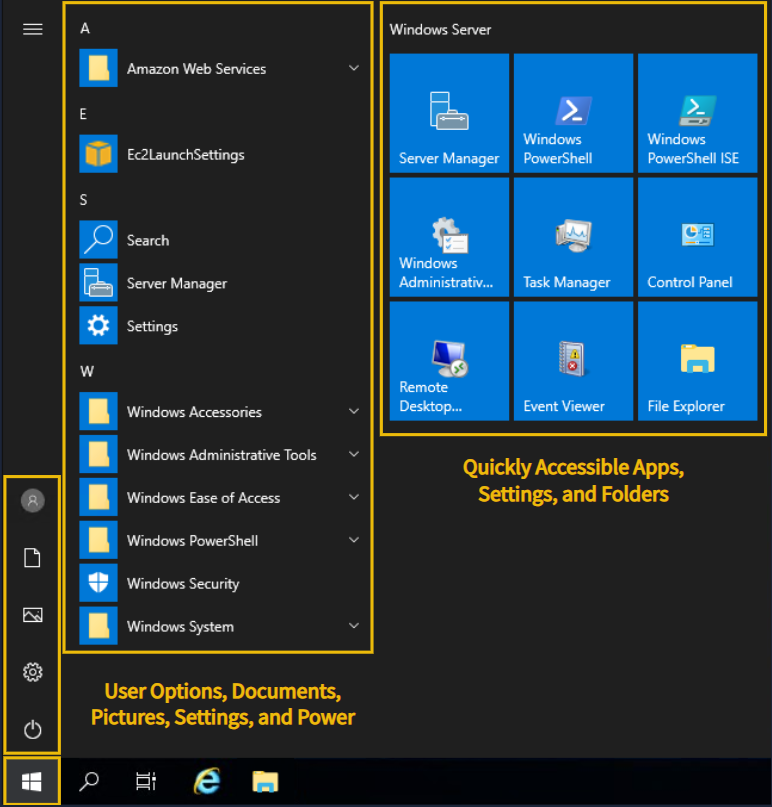
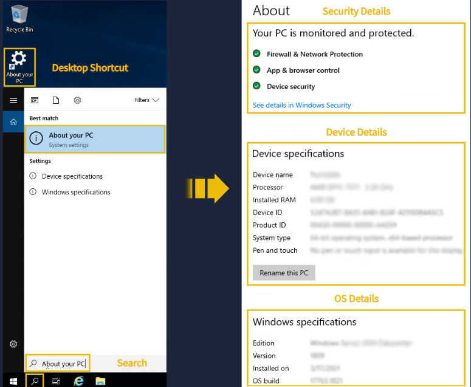

[<-- Back to Operating System Menu](../operating-system/00-MENU.md)

# 📌 Windows Basic – Kiến thức cơ bản Windows

> Windows là hệ điều hành của Microsoft, cung cấp môi trường đồ họa, quản lý người dùng, file, ứng dụng, cấu hình hệ thống và các cơ chế bảo mật cho máy tính.

---

## 📖 Khái niệm

### 1. Windows là gì?

Windows là họ hệ điều hành do **Microsoft** phát triển.

Trước khi Windows có giao diện hiện đại như ngày nay, máy tính cá nhân của Microsoft chủ yếu sử dụng **MS-DOS**, trong đó người dùng phải nhập lệnh bằng bàn phím thay vì sử dụng chuột và biểu tượng.

Năm **1985**, Microsoft phát hành **Windows 1.0**, một giao diện đồ họa chạy trên nền DOS.

Theo thời gian, Windows được bổ sung ngày càng nhiều chức năng và phát triển từ một giao diện đồ họa đơn giản thành một **hệ điều hành hoàn chỉnh**.

<table align="center">
  <tr>
    <td align="center">
      
       
      <i>Windows 1.0 (1985)</i>
    </td>
    <td align="center">
      
       
      <i>Windows ME (2000)</i>
    </td>
    <td align="center">
      
       
      <i>Windows 11 (2021)</i>
    </td>
  </tr>
</table>

Windows hiện nay cung cấp:

* GUI.
* User Management.
* File Management.
* Application Management.
* Hardware Management.
* Networking.
* Security.
* System Administration.

---

## ⚙️ Cách hoạt động

### 1. Logging in và Authentication

Trước khi truy cập Windows Desktop, người dùng phải thực hiện **Authentication** để chứng minh danh tính.

Authentication xác định:

* Người dùng là ai.
* Tài khoản nào đang được sử dụng.
* Người dùng có những quyền gì.
* Người dùng được phép truy cập tài nguyên nào.

---

### 2. Các loại tài khoản Windows

| Account           | Quyền                      | Mục đích            |
| ----------------- | -------------------------- | ------------------- |
| **Guest**         | Rất hạn chế                | Truy cập tạm thời   |
| **Standard**      | Quyền sử dụng thông thường | Công việc hằng ngày |
| **Administrator** | Quyền quản trị cao         | Quản lý hệ thống    |

> Trong môi trường thực tế, không nên sử dụng quyền Administrator cho mọi hoạt động nếu không cần thiết. Việc sử dụng quyền tối thiểu giúp giảm tác động khi tài khoản hoặc ứng dụng bị xâm phạm.

---

## 🖥️ Windows Desktop

Sau khi đăng nhập, người dùng được đưa tới **Desktop** – không gian làm việc chính của Windows.

  
   
  <i>Windows Desktop</i>

### Các thành phần chính

| STT Note  | Thành phần          | Chức năng                                    |
| -------   | ------------------- | -------------------------------------------- |
| 1         | **Desktop Icons**   | Shortcut đến file, folder và ứng dụng        |
| 2         | **Start Menu**      | Truy cập ứng dụng, settings và power options |
| 3         | **Search**          | Tìm file, folder, app và system settings     |
| 4         | **Task View**       | Xem và chuyển đổi giữa các cửa sổ            |
| 5         | **Pinned Apps**     | Truy cập nhanh ứng dụng thường dùng          |
| 6         | **Network & Audio** | Quản lý mạng và âm thanh                     |
| 7         | **Date & Time**     | Xem và cấu hình ngày giờ                     |
| 8         | **Notifications**   | Hiển thị thông báo hệ thống và ứng dụng      |
| 9         | **Taskbar**         | Thanh điều khiển và truy cập nhanh           |

---

## 🚀 Start Menu

**Start Menu** là một trong những điểm truy cập chính của Windows.

Có thể sử dụng Start Menu để:

* Mở ứng dụng.
* Tìm kiếm file.
* Truy cập Settings.
* Mở các công cụ hệ thống.
* Truy cập thư mục.
* Đăng xuất.
* Restart.
* Shutdown.

  
   
  <i>Start Menu</i>

---

## 🧰 Built-in Tools và Applications

Windows cung cấp nhiều ứng dụng và công cụ tích hợp sẵn.

Một số công cụ phổ biến:

* **File Explorer**
* **Notepad**
* **Calculator**
* **Paint**
* **Task Manager**
* **Settings**
* **Windows Security**

---

## 🖥️ System Information

Windows cung cấp các công cụ để xem thông tin của máy tính.

Một khu vực quan trọng là:

**Settings → About**

  
   
  <i>System Information</i>

---

## 📁 File Exploration và Management

Windows sử dụng cấu trúc thư mục **phân cấp (hierarchical)**.

Một thư mục có thể chứa:

* File.
* Subfolder.
* Các subfolder khác.

### File Explorer

**File Explorer** được sử dụng để:

* Mở file.
* Tạo folder.
* Xóa file.
* Di chuyển file.
* Sao chép file.
* Đổi tên.
* Chia sẻ.
* Tìm kiếm.
* Kiểm tra đường dẫn.

File Explorer cũng cho phép người dùng xem **full path** của thư mục hoặc file.

---

## 📦 Applications

Application là các chương trình được sử dụng để thực hiện các tác vụ trên máy tính.

Ví dụ:

* Web Browser.
* Text Editor.
* Media Player.
* Security Software.
* Development Tools.

---

## 🔄 Updating Applications

Cập nhật hệ điều hành và ứng dụng là một phần quan trọng của việc duy trì hệ thống.

Update thường bao gồm:

* Security Patches.
* Bug Fixes.
* Performance Improvements.
* Feature Updates.

---

### Application Update

Cách cập nhật ứng dụng phụ thuộc vào cách phần mềm được cài đặt.

Có thể xảy ra các trường hợp:

* Ứng dụng tự động cập nhật.
* Ứng dụng thông báo khi khởi động.
* Người dùng phải kiểm tra update thủ công.
* Người dùng phải tải installer mới.

---

## 📥 Installing Applications

Windows có nhiều cách cài đặt ứng dụng.

- Microsoft Store cung cấp kho ứng dụng được phân phối thông qua Microsoft.

Ưu điểm:

* Dễ sử dụng.
* Quản lý tập trung.
* Phù hợp với người dùng phổ thông.

> Microsoft Store không phải lúc nào cũng có sẵn hoặc được sử dụng trên Windows Server.

- Internet: Trong nhiều trường hợp, phần mềm được tải trực tiếp từ website của nhà phát triển.

> Khi tải phần mềm từ Internet, cần ưu tiên nguồn chính thức hoặc nguồn đáng tin cậy để giảm nguy cơ cài phải phần mềm độc hại.

---

## 🗑️ Uninstalling Applications

Windows cung cấp nhiều cách để gỡ ứng dụng.

Một số phương pháp:

* Microsoft Store.
* **Settings → Apps → Installed apps**.
* **Control Panel → Uninstall a program**.
* Uninstaller tích hợp của ứng dụng.

---

## ⚙️ Windows Settings và Control Panel

Windows có hai giao diện chính để cấu hình hệ thống.

### Windows Settings

**Settings** là giao diện hiện đại, tập trung các thiết lập như:

* System.
* Devices.
* Personalization.
* Apps.
* Accounts.
* Network.
* Accessibility.
* Privacy.
* Security.

### Control Panel

**Control Panel** là giao diện quản trị truyền thống của Windows.

Một số công cụ cũ và thiết lập quản trị vẫn được truy cập thông qua Control Panel.

---

## 📊 Task Manager

**Task Manager** là công cụ tích hợp cho phép theo dõi hoạt động của hệ thống theo thời gian thực.

Có thể sử dụng Task Manager để xem:

* Applications đang chạy.
* Background Processes.
* CPU Usage.
* Memory Usage.
* Disk Usage.
* Network Usage.
* Startup Applications.

---

## 🛡️ Windows Security

Windows cung cấp các công cụ bảo mật tích hợp để bảo vệ hệ thống trước:

* Malware.
* Ứng dụng không an toàn.
* Network traffic trái phép.
* Các mối đe dọa khác.

**Windows Security** là giao diện tập trung để quản lý các chức năng bảo vệ này.

Các khu vực chính gồm:

### Virus & Threat Protection

Giúp:

* Phát hiện malware.
* Loại bỏ malware.
* Real-time Protection.
* Thực hiện Security Scan.

### Firewall & Network Protection

Kiểm soát network traffic và ngăn các kết nối không được phép.

### App & Browser Control

Bảo vệ người dùng trước:

* Ứng dụng không an toàn.
* File đáng ngờ.
* Website nguy hiểm.

### Device Security

Cung cấp các cơ chế bảo vệ dựa trên phần cứng và các tính năng bảo mật của hệ thống.

---

## 🔥 Windows Defender Firewall

**Windows Defender Firewall** là firewall tích hợp của Windows.

Nó giám sát các kết nối mạng và sử dụng các rule để quyết định kết nối nào:

Firewall có thể kiểm soát:

* Inbound traffic.
* Outbound traffic.
* Application access.
* Network profile.

---

### Network Profiles

Windows Firewall có ba profile chính:

| Profile     | Mục đích                                 |
| ----------- | ---------------------------------------- |
| **Domain**  | Khi máy tham gia Domain của tổ chức      |
| **Private** | Mạng đáng tin cậy như Home hoặc Lab      |
| **Public**  | Mạng không đáng tin cậy như Public Wi-Fi |

---

### Windows Defender Firewall Advanced Settings

Phần Advanced Settings cho phép quản trị viên xem và quản lý:

* Inbound Rules.
* Outbound Rules.
* Connection Security Rules.
* Rule Status.
* Network Profile.
* Action.

---

## 📝 Ghi nhớ

* **Windows** phát triển từ hệ sinh thái DOS và giao diện Windows 1.0 thành một hệ điều hành hoàn chỉnh.
* **Authentication** xác minh danh tính trước khi người dùng truy cập hệ thống.
* **Desktop** là không gian làm việc chính.
* **Start Menu** là trung tâm truy cập ứng dụng, settings và power options.
* **File Explorer** dùng để quản lý file và thư mục.
* **Windows Update** giúp duy trì hệ điều hành được cập nhật.
* Ứng dụng có thể được cài từ **Microsoft Store** hoặc nguồn tin cậy trên Internet.
* **Settings** là giao diện cấu hình hiện đại.
* **Control Panel** là giao diện quản trị truyền thống.
* **Task Manager** dùng để theo dõi process và hiệu năng hệ thống.
* **Windows Security** cung cấp các chức năng bảo mật tích hợp.
* **Windows Defender Firewall** kiểm soát network traffic dựa trên firewall rules.

---

## 🔗 Liên quan

* **Operating System**
* **Windows**
* **MS-DOS**
* **Windows Server**
* **Authentication**
* **Authorization**
* **User Account**
* **Administrator**
* **File System**
* **NTFS**
* **PowerShell**
* **Command-Line Interface (CLI)**
* **Task Manager**
* **Windows Security**
* **Windows Defender**
* **Windows Defender Firewall**
* **Firewall Rules**
* **Network Security**
* **Malware**
* **System Administration**
* **Incident Response**

---

## 📚 Nguồn tham khảo

* [TryHackMe – Windows Basic](https://tryhackme.com/room/windowsbasics)
* Microsoft Learn – Windows
* Microsoft Learn – Windows Security
* Microsoft Learn – Windows Defender Firewall
* Microsoft Learn – PowerShell
* Microsoft Learn – Windows Update
* Microsoft Support – Windows Settings

[<-- Back to Operating System Menu](../operating-system/00-MENU.md)